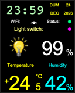
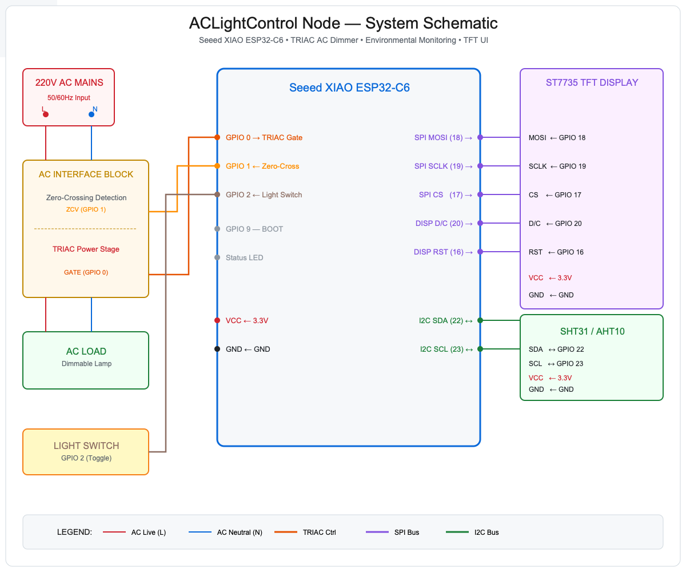
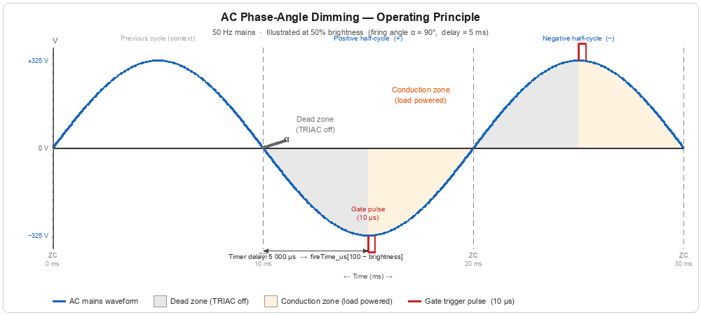
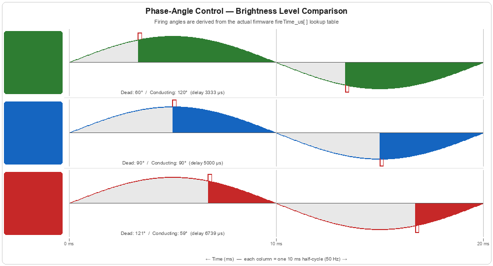
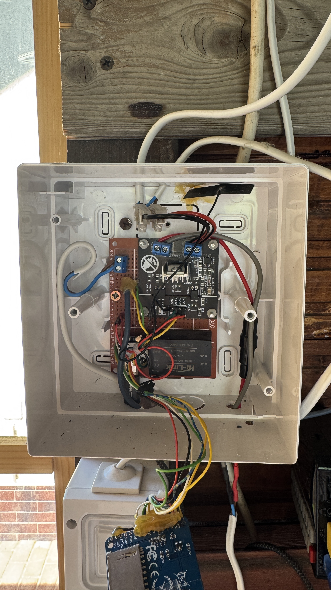
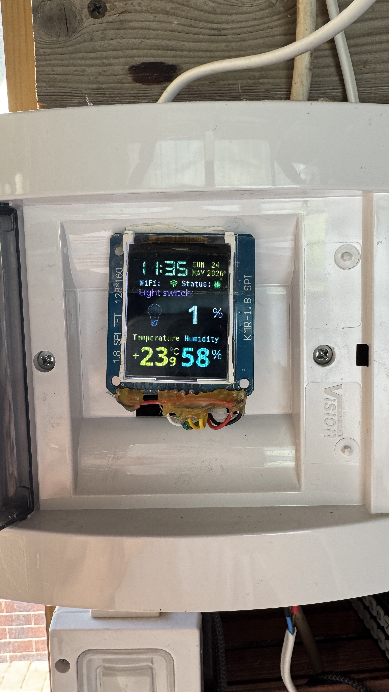
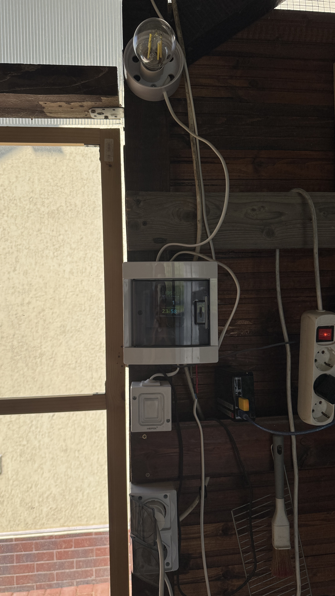

# ACLightControl - ESP32-C6 AC Light & Air Quality Node

ACLightControl is an integrated smart home device based on the **Seeed Studio XIAO ESP32-C6**. It serves two primary roles: a precise 220V AC light dimmer and a WiFi-connected sensor node for environmental monitoring.

## 🌟 Key Features

### 🔌 AC Light Control & Dimming
- **Linear Power Control:** Uses zero-crossing detection (GPIO 1) and a custom sine-wave lookup table (100 equal-area slices) to achieve true linear power delivery to AC loads.
- **Gradual Transitions:** Smooth fade-in (~5 s, +20%/step) and a graduated fade-out (~2 min, rate slows from −5%/s down to −1% per 30 s near minimum) for a comfortable lighting experience.
- **Multiple Control Methods:**
  - **Physical Switch:** Local toggle button support with debouncing.
  - **Automated Scheduling:** Monthly programmable ON/OFF times stored in `data/times.txt`.

### 📶 Network & Connectivity
- **WiFi Reporting:** Reports local temperature and humidity data to a central web server via HTTP POST.
- **Time Sync:** Accurate internal RTC synchronization via NTP over WiFi.

### 🖥️ Monitoring & UI
- **Local Sensors:** Supports SHT31 or AHT10 environmental sensors for temperature and humidity.
- **Graphical Interface:** 1.8" ST7735 TFT display (128x160) utilizing **LVGL v9** and **LovyanGFX** for real-time status visualization.

  

## 🛠 Hardware Specifications



> **Note:** The hardware is built on a **perfboard** with directly soldered wires. There are no official schematics or PCB designs created in an electronics CAD tool; the diagram above represents the logical architecture and physical wiring.

### Core Components
- **Microcontroller:** [Seeed Studio XIAO ESP32-C6](https://www.seeedstudio.com/Seeed-Studio-XIAO-ESP32-C6-p-5884.html)
  - RISC-V 32-bit single-core processor (up to 160 MHz).
  - Support for WiFi 6, Bluetooth 5, and IEEE 802.15.4 (Zigbee/Thread — 802.15.4 not used in this firmware).
- **Display:** 1.8" TFT LCD (ST7735 driver), 128x160 pixels.
- **Sensors:** SHT31 or AHT10 (I2C) for temperature and humidity.
- **AC Power Control:**
  - **Zero-Crossing Detector:** Optically isolated for safe AC phase synchronization.
  - **TRIAC Dimmer:** High-voltage TRIAC for precise load control.
- **Antenna:** Supports on-board or external antenna via software-controlled RF switch.

### Pin Mapping (XIAO ESP32-C6)

| Function | Pin | Description |
| :--- | :--- | :--- |
| **TRIAC Gate** | GPIO 0 | Gate trigger for AC power control |
| **Zero-Crossing** | GPIO 1 | ZCV detection input (Interrupt-based) |
| **External Switch** | GPIO 2 | Physical toggle button input |
| **Display MOSI** | GPIO 18 | SPI Master Out Slave In |
| **Display SCLK** | GPIO 19 | SPI Serial Clock |
| **Display CS** | GPIO 17 | SPI Chip Select |
| **Display D/C** | GPIO 20 | Data/Command selection |
| **Display RST** | GPIO 16 | Display Reset |
| **I2C SDA** | GPIO 22 | Data line for SHT31/AHT10 sensors |
| **I2C SCL** | GPIO 23 | Clock line for SHT31/AHT10 sensors |
| **Boot Button** | GPIO 9 | Built-in bootloader/user button |
| **Status LED** | LED_BUILTIN | Built-in system status indicator |

## 🏗️ Architecture

The firmware is built on the **Arduino** framework using **FreeRTOS** for task management.

### Software Layers
1.  **Application Layer (`main.cpp`):** Orchestrates the control state machine, task scheduling, and high-level logic.
2.  **UI Layer (`src/gui/`):** Manages the LVGL UI objects and display updates.
3.  **Hardware Abstraction:** Interrupt-based TRIAC firing and zero-crossing detection.

### FreeRTOS Tasks

All three tasks run at equal FreeRTOS priority (`tskIDLE_PRIORITY + 1`) and share a single mutex. They are differentiated by their sleep period, not priority level.

- **`task10ms`** (10 ms period): LVGL UI handler, serial command parsing, watchdog reset.
- **`task1s`** (1 s period): Status LED toggle, switch debounce, WiFi reconnect, RTC read, light state machine, display update.
- **`task60s`** (60 s period): Sensor reading, HTTP POST to web server, hourly NTP re-sync.

---

## 🔆 AC Dimming — How It Works

Dimming a resistive AC load (incandescent or halogen bulb) is done through **phase-angle control**: instead of delivering the full AC sine wave to the load, only a portion of each half-cycle is conducted. The later the TRIAC is triggered within a half-cycle, the less energy is delivered per cycle, and the dimmer the light.

### Zero-Crossing Detection

Every AC cycle the mains voltage passes through zero twice — once rising (positive half-cycle) and once falling (negative half-cycle). These **zero-crossing events** are the timing reference for the entire dimming chain.

An **opto-isolated zero-crossing detector** circuit monitors the mains and pulls GPIO 1 on each rising edge. Galvanic isolation is critical: it keeps the high-voltage AC side completely separated from the ESP32-C6 logic. The ISR is placed in IRAM so it executes from fast on-chip RAM and is never delayed by flash cache misses:

```c
void IRAM_ATTR zeroCrossISR() {
    timerRestart(dimmTimer);
    timerAlarm(dimmTimer, fireTime_us[100 - light_brightness], false, 0);
}
```

Each zero-crossing restarts a **1 MHz hardware timer** (1 µs resolution) with a pre-computed delay that determines when in the half-cycle the TRIAC gate will be triggered.

### TRIAC Phase-Angle Control

A **TRIAC** is a bidirectional semiconductor switch. Once its gate receives a brief trigger pulse it conducts current in both directions until the current drops below the holding threshold — which happens naturally at the next zero crossing. This means:

- Trigger **early** in the half-cycle → large conduction window → **high brightness**
- Trigger **late** → small conduction window → **low brightness**

The waveform below illustrates a 50% brightness example, where the firing angle α = 90° splits each half-cycle equally between the dead zone and the conduction zone:



When the hardware timer expires a second ISR fires the TRIAC gate with a 10 µs pulse:

```c
void IRAM_ATTR dimmTimerISR() {
    fireTriac();  // GPIO0 → HIGH, delay 10 µs, GPIO0 → LOW
}
```

### Perceptually Linear Brightness — the Lookup Table

Mapping brightness percentages to equal **time** fractions through the half-cycle would not produce a perceptually linear result, because instantaneous AC power is proportional to `sin²(θ)`. Doubling the conduction angle does not double the delivered power.

The firmware uses a pre-computed 100-entry table `fireTime_us[100]` where each step represents an **equal-area slice of the half-sine curve**, so every 1% brightness increment delivers the same additional power to the load. Values range from `0 µs` (full on) to `9 362 µs` (nearly off). At 50% brightness the delay is exactly **5 000 µs** (90° firing angle, midpoint of the 10 ms half-cycle).

> [!NOTE]  
> **Stable Dimming Limits:** To achieve a fully OFF or fully ON state without flickering, use **1%** (OFF) and **98%** (ON). Firing the TRIAC at exactly 0% or 100% can lead to timing instabilities and visible flickering as the gate trigger aligns too closely with the zero-crossing point.

The diagram below compares the three brightness zones, with firing angles taken directly from the `fireTime_us[]` firmware table:



### Software Timing Chain

```
  Zero crossing detected (GPIO1 ↑ RISING)
        │
        ▼
  zeroCrossISR()                [IRAM — µs latency]
    ├─ restart 1 MHz HW timer
    └─ set alarm: fireTime_us[100 − brightness] µs
        │
        │    ← timer counts down (0 µs … 9 362 µs) →
        │
        ▼
  dimmTimerISR()                [IRAM — µs latency]
    └─ fireTriac()
         ├─ GPIO0 → HIGH
         ├─ delayMicroseconds(10)
         └─ GPIO0 → LOW
        │
        ▼
  TRIAC conducts until current → 0 at next zero crossing
```

### Brightness Bounds

| Constant | Value | Purpose |
| :--- | :--- | :--- |
| `BRIGHT_FULL_OFF` | 1% | Idle — `fireTime_us[99]` = 0 µs; gate fires at the zero crossing (0 V) where the TRIAC cannot latch; bulb stays off |
| `BRIGHT_DIMM_MIN` | 5% | Minimum usable dimming level (TRIAC reliably triggers near end of half-cycle) |
| `BRIGHT_DIMM_MAX` | 95% | Maximum dimming level (TRIAC reliably releases at next zero crossing) |
| `BRIGHT_FULL_ON`  | 98% | Steady fully-on state |

The 5–95% operating band avoids the edges of each half-cycle where the TRIAC gate becomes unreliable at voltages too close to zero.

---

## 📁 Repository Structure

```text
.
├── Hardware/
│   ├── hw_architecture.png          # Physical wiring architecture diagram
│   ├── dimming_waveform.png         # Phase-angle dimming principle diagram
│   ├── dimming_levels.png           # Brightness level comparison diagram
│   ├── assembly1.jpg                # Internal electronics (open enclosure)
│   ├── assembly2.jpg                # Front panel display close-up
│   └── assembly3.jpg                # Full installation in bird room
├── Software/
│   ├── ACLightControl/              # Main Firmware (PlatformIO Project)
│   │   ├── src/                     # Core logic and GUI implementation
│   │   ├── lib/                     # Drivers (LVGL, LovyanGFX, Sensors)
│   │   └── data/                    # LittleFS assets (calib.txt, times.txt)
│   ├── ACLightCtrlEEZ-GUI/          # UI Design project (EEZ Studio)
│   └── array_generation.py          # Sine-wave equal-area slice calculator
└── README.md
```

---

## 🛠️ Build & Configuration

The project is managed via **PlatformIO**.

### Build Environment
- **Platform:** Espressif 32 (ESP32-C6)
- **Framework:** Arduino
- **Partition Scheme:** `huge_app.csv`

### Key Files
- `data/calib.txt.cfg`: Configuration template. **Rename this to `calib.txt`** and fill in your real WiFi credentials, server URL, and API key before uploading.
- `data/calib.txt`: (Ignored by Git) Your local configuration file containing real secrets.
- `data/times.txt`: Monthly schedule definitions.

### Setup Instructions
1. Navigate to `Software/ACLightControl/data/`.
2. Rename `calib.txt.cfg` to `calib.txt`.
3. Open `calib.txt` and replace the placeholder values with your actual WiFi SSID, Password, Server URL, and API Key.
4. Use the `uploadfs` command below to write these settings to the device's LittleFS.

### Commands
```bash
# Compile firmware
pio run

# Upload to device
pio run -t upload

# Upload filesystem (LittleFS)
pio run -t uploadfs

# Open serial monitor
pio device monitor --baud 115200
```

---

## 🔧 Physical Assembly & Installation

> [!CAUTION]
> # ⚡ HIGH VOLTAGE — RISK OF DEATH ⚡
>
> **This device is directly connected to 220–240V AC mains voltage.**
>
> - **220V AC can kill.** Even brief contact with live conductors is potentially fatal.
> - **ALWAYS disconnect mains power** before opening the enclosure, touching any wiring, or handling any component inside.
> - **Do not operate** with the enclosure open or with exposed live conductors.
> - **There is NO galvanic isolation** between the mains wiring and the PCB ground plane inside this enclosure.
> - This device was built for **personal use only** and has **not been certified** to any safety standard (CE, UL, etc.).
> - **Replicate at your own risk.** If you are not a qualified electrician or do not have experience working with mains voltages, **do not attempt to build or modify this device.**

---

The device is housed in a standard plastic junction box mounted directly on the wooden wall of a bird room. All mains-voltage components are enclosed. Only the display window and an external switch are accessible during normal operation.

### Internal Electronics



The interior of the enclosure (Vision standard plastic junction box) showing the custom hand-soldered assembly:

- **Brown perfboard** (left) — the main logic carrier, where the **XIAO ESP32-C6** and sensor connections are located.
- **Black AC Module** (right) — a custom-built high-voltage stage containing the **TRIAC circuit** and **Zero-Crossing Detector**. It is mounted on top of the perfboard for a compact footprint.
- **Hi-Link Power Supply** (bottom) — a compact HLK-PM01 AC-DC module providing regulated 5V power to the logic board from the 220V mains.
- **Wiring** — High-voltage AC supply wires (Line - brown/red + 0.5A fuse, Neutral - blue/gray) enter from the bottom; controlled AC supply to light bulbs exit from top; USB cable and low-voltage wires to the switch go out on bottom also.

> ⚠️ **Caution:** All internal modules and exposed terminals carry **live mains voltage** during operation. Proper insulation and secure mounting are critical.

---

### Front Panel Display



The **1.8" TFT display** (KMR-1.8 SPI) is secured behind the transparent window of the **Vision junction box**. The UI, rendered via LVGL, provides real-time monitoring of all system parameters at a glance.

The image above shows the system in with **light off state** (1% brightness), reporting a temperature of **+23.9°C** and **58%** humidity.

---

### Full Installation



The complete unit is installed on a wooden support structure in the bird room. Key elements of the final setup:
- **LED Filament Bulb:** The controlled AC load, mounted at the top.
- **Vision Enclosure:** Houses the main controller and AC power stage.
- **Physical Toggle Switch:** Mounted directly below the box for manual overrides (connected to GPIO 2).
- **Wiring:** Industrial-grade cables provide safe 220V power to the controller and the lamp.

---

## 📝 License
This project is for personal and educational purposes. I developed this system to automate the lighting schedule and monitor environmental conditions in my bird room.
